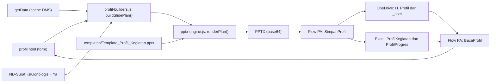

# Blueprint: Profil Progres Kegiatan (PPTX) — DMS Subdit Wil 2

Status: disetujui · **Fase 0–3 selesai (kode); flow `SimpanProfil` dan `BacaProfil` sudah dibuat dan terhubung ke halaman** (lihat bagian 8 dan 12; `profil/README_FASE0.md` s.d. `README_FASE3.md`, `docs/FLOW_SimpanProfil.md`) · Pembaruan terakhir: 21 September 2026 · Acuan: `Profil_Pembangunan_Kantor_Bupati_Pohuwato.pptx` (8 slide)

## 1. Ringkasan keputusan

| # | Keputusan | Alasan |
|---|---|---|
| 1 | Metode **hybrid**: template `.pptx` berisi slide prototipe, generator menyalin dan mengisinya di browser | Jumlah slide dokumentasi dan kronologis bervariasi |
| 2 | Pola **plan → render**: data diubah dulu menjadi daftar slide (*slide plan*), baru dirender ke PPTX | Penggabungan antar-kegiatan nanti cukup menyambung dua *plan* |
| 3 | **Tidak memakai docxtemplater untuk PPTX**; pengisian tag dan penyalinan slide ditulis sendiri di atas PizZip | Data per slide berbeda-beda, dan itu butuh modul slide berbayar. Modul gambar gratisnya juga setahu saya hanya untuk `.docx` |
| 4 | **Kronologis dibuat native** dari data DMS (`isKronologis = Ya`), bukan tautan Excel | Disetujui; slide 2 contoh adalah objek tertaut ke `.xlsx` di SharePoint |
| 5 | Data dibagi dua: **profil dasar** (statis, isi sekali per kegiatan) dan **snapshot progres** (tiap laporan) | Form periodik hanya berisi hal yang benar-benar berubah |
| 6 | Semua komputasi di browser; Power Automate hanya menyimpan file dan baris Excel | Sama dengan pola notulensi dan ND yang sudah berjalan |
| 7 | **Fase dev berdiri sendiri** di folder `profil/`: tidak menyentuh `dms-shared.js`, `navbar.js`, `index.html`, dan halaman lain sampai tahap integrasi | Halaman produksi memakai fungsi global yang bisa saling menimpa; fitur baru masih sering berubah |
| 8 | **Kunci baris Excel = path** (`PathPPTX`, `PathFolder`), bukan kombinasi kolom | Konektor Excel hanya mendukung satu kondisi di Filter Query; path sudah unik per kegiatan, tanggal, dan judul |
| 9 | **Profil dasar dan gambar statis dibaca lewat flow terpisah `BacaProfil`** dan ditulis lewat `SimpanProfil` | `GetMasterData` produksi tidak diubah; gambar statis berupa berkas di `_aset/`, bukan kolom Excel |
| 10 | **PizZip disertakan lokal** (`libs/`), bukan CDN | Pada uji di HP, PizZip dari CDN gagal dimuat |

## 2. Arsitektur



**Prinsip:** engine tidak tahu apa itu "kegiatan". Ia hanya menerima *slide plan* dan template. Logika bisnis (format rupiah, deviasi, pembagian foto, pagination kronologis) ada di `profil-builders.js`, sehingga bisa diuji tanpa membuka PowerPoint.

**Arah baca:** profil dasar, tiga gambar statis, dan laporan terakhir dibaca lewat flow `BacaProfil` saat kegiatan dipilih. Arah tulis hanya lewat `SimpanProfil`.

Contoh *slide plan*:

```js
[
  { type: 'cover',      data: { judul, tanggal_cover } },
  { type: 'kronologis', data: { judul, rows: [...] } },   // bisa lebih dari 1 slide
  { type: 'latar',      data: { ... }, images: { pra, pasca } },
  { type: 'profil',     data: { ... }, photos: [ ...maks 6 ] },
  { type: 'kurvas',     images: { kurvas } },
  { type: 'dokumentasi', photos: [ ...1–6 ] },            // diulang sesuai jumlah foto
  { type: 'terimakasih' }
]
```

## 3. Struktur file

### 3.1 Fase development (mandiri, tidak mengubah file lama)

```
profil/
  profil.html                  form (header sendiri, tanpa navbar.js)
  pptx-engine.js               salin slide, isi tag, tabel, foto, tulis ZIP
  profil-builders.js           buildSlidePlan(), format angka/tanggal, pembagi foto, estimator tabel
  profil-kit.js                SALINAN helper dari dms-shared.js, dalam namespace ProfilKit
  profil-live.js               pembaca data master DMS (hanya baca, cache sendiri)
  profil-save.js               path folder, nama file, snapshot, payload, kirim ke flow SimpanProfil
  profil-master.js             profil dasar (tabel ProfilKegiatan) + gambar statis (_aset); membaca balasan BacaProfil
  profil-ai.js                 "Rapikan dengan AI" (Gemini LITE), tanpa menambah fakta
  profil-config.js             URL flow: getData (yang ada), saveFlowUrl (SimpanProfil), readFlowUrl (BacaProfil)
  libs/pizzip.min.js           PizZip 3.2.0 lokal (bukan CDN)
  docs/FLOW_SimpanProfil.md    panduan flow SimpanProfil + BacaProfil + tabel Excel + pemecahan masalah
  docs/schema_SimpanProfil.json  skema trigger lengkap (tempel ke aksi trigger)
  templates/
    Template_Profil_Kegiatan.pptx
    template_manifest.json
  sample_data/  pohuwato.json + getdata_fixture.json + photos/
  tests/        run_tests.js (17 skenario), test_live_save.js, test_master_ai.js, smoke_*.js, mock_flow.js, make_payload.js
  tools/        skrip Python untuk membangun dan memeriksa template; build_demo.py
  README_FASE0.md ... README_FASE3.md
```

- Helper yang disalin ke `profil-kit.js` dibungkus `ProfilKit.*` dan diberi penanda "salinan dari `dms-shared.js`", supaya tidak ada nama global yang bentrok.
- PizZip dipatok satu versi dan disertakan lokal (`libs/pizzip.min.js`); cache memakai key sendiri (`profil_dev_cache`).
- Fase 0–1 memakai data tiruan (`sample_data`), hasilnya diunduh sebagai file. Fase 2–3 membaca data live dari `GetMasterData` (hanya baca), sedangkan penyimpanan dan pembacaan profil memakai flow dan tabel Excel **baru**. `GetMasterData` produksi tidak diubah.
- Skrip uji dijalankan dengan `npm test` (Node + jsdom + flow tiruan `tests/mock_flow.js`).

### 3.2 Tahap integrasi (setelah fitur stabil)

| Langkah | File | Catatan |
|---|---|---|
| 1 | `profil-kit.js` → `dms-shared.js` | Ganti salinan helper dengan pemanggilan asli; tambah `TEMPLATE_FILES.PROFIL` dan `FolderPathBuilder.profil()` (sekarang `ProfilSave.folderProfil()`) |
| 2 | `navbar.js` | Menu "Profil". Navbar HP sudah 6 ikon; menu ke-7 dicek di layar 360px |
| 3 | `index.html` | Kartu "Profil Kegiatan" di *Buat Dokumen Baru* |
| 4 | `kronologis.html` | Filter kegiatan sekarang hanya mencocokkan **Nama Kegiatan**. Nama seperti "01. Notulensi" ada di banyak provinsi, jadi harus **Provinsi + Nama Kegiatan** (fitur profil sudah memakai filter yang benar) |
| 5 | Power Automate | Profil dibaca lewat `BacaProfil`, jadi tabel `ProfilKegiatan` dan `ProfilProgres` di `GetMasterData` hanya perlu ditambahkan bila dashboard (fase 5) ingin membacanya langsung |
| 6 | Semua halaman | Samakan versi PizZip (sekarang unpkg 3.1.6 di notulensi, jsdelivr 3.1.4 di ND, 3.2.0 lokal di profil) |
| 7 | `dms-shared.js` | Perbaiki normalisasi nama kolom: `replace(/[\s_]\|_x0020_/g, '')` mencoba `[\s_]` lebih dulu sehingga varian `Nama_x0020_Kegiatan` tidak pernah cocok lewat jalur normalisasi. Urutan yang benar: `_x0020_` dulu (sudah dibetulkan di `ProfilKit.getv`) |
| 8 | Templat folderisasi | Tambahkan `H. Profil` supaya kegiatan baru langsung punya folder ini |

## 4. Template PPTX

### 4.1 Tujuh slide prototipe (urutan tetap)

| No | Prototipe | Sumber di contoh | Sifat |
|---|---|---|---|
| 1 | `cover` | Slide 1 | 1× |
| 2 | `kronologis` | Slide 2 (diganti tabel native) | 1..N slide, otomatis |
| 3 | `latar` | Slide 3 | 1×, dilewati jika kosong |
| 4 | `profil` | Slide 4 | 1× |
| 5 | `kurvas` | Slide 5 | 1×, dilewati jika tanpa gambar |
| 6 | `dokumentasi` | Slide 6–7 | 1..N slide, sesuai jumlah foto |
| 7 | `terimakasih` | Slide 8 | 1× |

Prototipe dikenali dari **urutan slide**. Saat dimuat, engine memeriksa semua tag wajib ada dan memberi pesan jelas bila desainer menghapus atau menggeser sesuatu.

### 4.2 Konvensi penamaan (diatur lewat *Selection Pane*, Alt+F10)

| Konvensi | Arti |
|---|---|
| `{nama_tag}` di teks | Diganti nilai. Satu tag per paragraf |
| `{daftar.field}` di sel tabel (mis. `{kron.no}`, `{pihak.nama}`) | Baris berurutan yang memuat tag berawalan `daftar.` menjadi satu grup, digandakan per item |
| Bentuk bernama `proto:caption` (di luar kanvas) | Sumber gaya keterangan foto; disalin generator, gayanya bisa diedit di PowerPoint |
| `{@nama_list}` | Paragraf ini digandakan sebanyak item list (bullet dan nomor ikut gaya paragraf) |
| Bentuk bernama `area:foto` | Kotak penanda; engine membuangnya lalu menata foto di dalam batasnya |
| Bentuk bernama `img:kurvas`, `img:pra`, `img:pasca`, `img:design3d` | Slot gambar tunggal |
| Tabel bernama `tbl:kron`, `tbl:spek`, `tbl:status` | Baris header dibiarkan; baris contoh diduplikasi per data |
| Baris tabel / bentuk yang semua tag-nya kosong | Dibuang otomatis (slot template ≠ jumlah data) |

Teks contoh terpecah menjadi banyak potongan (*run*) akibat spell-check (`err="1"`). Engine menggabungkan potongan hanya jika sebuah tag terbelah, dan membuang atribut `err`.

### 4.3 Kamus tag

**Global** (header semua slide)

| Tag | Contoh | Sumber |
|---|---|---|
| `{judul_kegiatan}` | PEMBANGUNAN KANTOR BUPATI POHUWATO | Master kegiatan (huruf besar otomatis) |
| `{kode_kontrak}` | SYC | Profil dasar; dipakai pada "Deviasi SYC" |
| `{lokasi}` | Kab. Pohuwato, Provinsi Gorontalo | Profil dasar |
| `{label_program}` | SYC 2026 | Profil dasar |
| `{tanggal_cover}` | 03 Agustus 2026 | Tanggal data laporan |

**latar**

| Tag | Isi |
|---|---|
| `{@latar_belakang}` | Paragraf |
| `{@maksud_tujuan}` | Paragraf |
| `img:pra`, `img:pasca` + `{cap_pra}`, `{cap_pasca}` | Dua foto kondisi dan keterangannya. Judul seperti "Pra-Kerusuhan" hanya cocok untuk Pohuwato, jadi keterangan diisi bebas |

**profil**

| Tag / objek | Isi |
|---|---|
| `tbl:spek` | Nama pekerjaan, lokasi, masa pelaksanaan, luas persil, luas bangunan (baris opsional), lalu **grup pihak berulang** (`{pihak.peran}`, `{pihak.nama}`, `{pihak.nilai}`), lalu lingkup pekerjaan |
| `{nama_pekerjaan}`, `{lokasi_pekerjaan}` | Nilai baris tabel (berbeda dengan `{lokasi}` singkat di header) |
| `{masa_pelaksanaan}` | `217 Hari Kalender (29 Mei 2026 – 31 Desember 2026)`, dihitung otomatis dari tanggal mulai–selesai (inklusif) |
| `{@masalah}`, `{@tindak_lanjut}` | Dua kolom daftar bernomor, tidak dipasangkan per baris |
| `{tanggal_status}` | `16 Agustus 2026` |
| `{fisik_rencana}` `{fisik_realisasi}` `{fisik_deviasi}` | Angka koma 2 desimal |
| `{keu_rencana}` `{keu_realisasi}` `{keu_deviasi}` | Idem |
| `img:design3d`, `area:foto` | Gambar rencana dan foto sorotan (0–6) |

**dokumentasi**: `area:foto` saja (foto dan keterangan dibuat oleh engine).

**kronologis**: `tbl:kron` (1 baris header + 1 baris contoh) dengan kolom `{kron.no}` `{kron.tanggal}` `{kron.uraian}` `{kron.nomor}` `{kron.dari}` `{kron.ke}`. Warna selang-seling diatur di `template_manifest.json` (`zebra`).

## 5. Model data

### 5.1 Tabel Excel baru

Kedua tabel ditulis dan dibaca lewat flow `SimpanProfil` / `BacaProfil` (bukan `GetMasterData`), sehingga flow produksi tidak disentuh. Kunci baris memakai **path**, bukan kombinasi kolom: konektor Excel hanya mendukung **satu** kondisi di Filter Query (`and`/`or` ditolak dengan `Invalid filter clause: unsupported operation`), dan path sudah unik.

**`ProfilKegiatan`** (statis; satu baris per kegiatan; kunci = `PathFolder`)

| Kolom | Catatan |
|---|---|
| **PathFolder** | Kunci: `…/{Kegiatan}/H. Profil` (= `targetFolderPath`). Nama kolom tanpa spasi |
| Provinsi, Nama Kegiatan | Identitas |
| Judul Profil, Kode Kontrak, Tahun | Label program di slide = `{Kode Kontrak} {Tahun}` (mis. "SYC 2026"); tidak disimpan terpisah |
| Lokasi Singkat, Lokasi Pekerjaan | Lokasi singkat = header slide; lokasi pekerjaan = baris tabel spesifikasi |
| Latar Belakang, Maksud Tujuan | Teks panjang; paragraf dipisah baris kosong |
| Tgl Mulai, Tgl Selesai | `YYYY.MM.DD` (konsisten dengan tabel lain) |
| Luas Persil, Luas Bangunan | Angka |
| Pihak (JSON) | `[{peran, nama, nilai}]` |
| Lingkup | Satu item per baris |
| Cap Pra, Cap Pasca | Keterangan foto kondisi awal dan berikutnya |
| Diubah Oleh, Diubah Pada | Audit (`pic` dan `timestamp`) |

Gambar statis (design 3D, kondisi awal, kondisi berikutnya) **tidak** disimpan di kolom Excel, melainkan sebagai berkas di folder `_aset/` (lihat 5.2).

**`ProfilProgres`** (satu baris per laporan; kunci = `PathPPTX`)

| Kolom | Catatan |
|---|---|
| **PathPPTX** | Kunci: `targetFolderPath/fileName`. Satu file = satu baris. Nama kolom tanpa spasi |
| Provinsi, Nama Kegiatan, Tanggal Status | `YYYY.MM.DD` |
| Judul | |
| Fisik Rencana/Realisasi, Keu Rencana/Realisasi | Angka; deviasi tidak disimpan (dihitung) |
| Masalah, Tindak Lanjut | Satu item per baris |
| Jumlah Foto, Jumlah Slide | Ringkasan |
| Link PPTX | Tautan hasil unggah |
| Snapshot | JSON teks laporan (tanpa gambar dan tanpa baris mentah), termasuk daftar kronologis yang dikecualikan |
| PIC, Timestamp | Audit |

Konsekuensi kunci path: laporan dengan tanggal **dan** judul yang sama menimpa file dan barisnya; jika tanggal atau judul berubah, nama file berubah sehingga tercatat sebagai laporan baru.

Snapshot hanya menyimpan **teks**. Foto tidak disimpan ulang karena sudah ada di PPTX. Tombol "Salin angka & catatan dari laporan …" mengisi angka, permasalahan, dan tindak lanjut dari laporan terbaru (dibaca dari baris `ProfilProgres` lewat `BacaProfil`, maksimal 3 laporan terbaru); foto diunggah baru (memang selalu baru).

### 5.2 Lokasi OneDrive

```
/SUBDIT WILAYAH 2 BPB/{Provinsi}/{Kegiatan}/H. Profil/{YYYY.MM.DD} - Profil {ringkas}.pptx
/SUBDIT WILAYAH 2 BPB/{Provinsi}/{Kegiatan}/H. Profil/_aset/{design3d|pra|pasca}.jpg
```

- `{YYYY.MM.DD}` = tanggal status. `{ringkas}` = judul dipotong deterministik ≤ 50 karakter di batas kata (`ProfilSave.ringkasNama`, tanpa Gemini dan tanpa panggilan jaringan).
- Folder `A`–`G` sudah dipakai (`G. Kronologis` terlihat di tautan contoh), sehingga `H` dipakai fitur ini. Flow membuat folder `H. Profil` bila belum ada. Konfirmasi tetap: `H` belum dipakai untuk hal lain (bagian 11).
- `_aset/` hanya diisi bila kotak "Simpan profil dasar & gambar statis sebagai default" dicentang. Nama berkas selalu `.jpg` karena semua gambar dikompres ke JPEG di browser.
- Kegiatan yang belum terdaftar di DMS ditolak (buat dulu lewat form Notulensi/ND agar terfolderisasi). Provinsi `19. Kegiatan Lainnya` **tidak didukung** (bukan kegiatan fisik).

### 5.3 Flow `SimpanProfil` dan `BacaProfil`

Keduanya memakai trigger HTTP dan **wajib** diset "Who can trigger the flow? = Anyone". Bawaan flow baru adalah "Any user in my tenant": URL tanpa `sig=` dan panggilan dari browser ditolak `401 — The OAuth authorization scheme is required`. Setelah mengubahnya, simpan flow lalu salin ulang URL ke `profil-config.js`. Halaman memeriksa URL tanpa `sig=` sebelum mengirim dan menjelaskan langkahnya saat menerima 401/403.

**`SimpanProfil`** — input (skema lengkap: `docs/schema_SimpanProfil.json`):

```
{ action, provinsi, namaKegiatan, namaKegiatanFolder, targetFolderPath, fileName, pathPptx, pptxBase64,
  tanggalStatus, judul, fisikRencana, fisikRealisasi, keuRencana, keuRealisasi, masalah, tindakLanjut,
  jumlahFoto, jumlahSlide, snapshotJson, pic, timestamp, payloadMB, simpanMaster, master?, aset? }
```

Payload dilewatkan `sanitizeControlChars()` seperti flow lain. Langkah: validasi jalur (Condition) → `Get file metadata using path` untuk folder kegiatan (pengaman fisik, sesuai prinsip di `dms-shared.js`) → pastikan folder `H. Profil` ada → simpan PPTX (Create file, atau Update file bila sudah ada) → ambil tautan → upsert `ProfilProgres` (kunci `PathPPTX`) → bila `simpanMaster`: upsert `ProfilKegiatan` (kunci `PathFolder`) dan simpan `aset` ke `_aset/` → Response `{ linkBerkas, filePath }`. Galat dibungkus Scope dan dibalas 500 `{ error: { message } }`. Setelah sukses, halaman memanggil `clearCache()`.

Aturan payload yang penting:

- `master` dan `aset` hanya dikirim bila kotak "Simpan profil dasar…" dicentang. Kotak tercentang otomatis saat profil dasar atau gambar statis berubah, atau bila belum ada profil tersimpan.
- Saat `simpanMaster` = true, `aset` **selalu berupa array** (kosong bila tidak ada gambar baru), supaya *For each* di PA tidak menerima null. Pengaman di PA: `coalesce(triggerBody()?['aset'], json('[]'))`.
- Gambar statis dianggap "sudah di server" hanya bila key-nya berawalan `aset:` (hasil `BacaProfil`). Selain itu dianggap baru dan ikut terkirim, baik foto tempel (`foto:…`) maupun gambar data uji (`photos/…`).

**`BacaProfil`** — input `{ action: 'bacaProfil', provinsi, namaKegiatan, folderPath }`; output `{ found, master, aset: [{ nama, ext, base64 }], laporan: [3 terbaru] }` atau `{ found: false }`. Aksi Response **wajib memiliki Body**: Response tanpa Body membuat halaman menganggap kegiatan belum punya profil dasar.

## 6. Aturan generator

### 6.1 Format nilai
- Angka: `Intl.NumberFormat('id-ID')`. Uang menjadi `Rp. 37.268.364.000`; persen `11,63`. Ini menghilangkan campuran `1.079,968.728` dan `20.00` seperti pada contoh.
- Deviasi = realisasi − rencana, hasil `-3,95` / `0,00`.
- Tanggal memakai `formatTanggalIndonesia()` yang sudah ada (`03 Agustus 2026`).
- Semua teks di-*escape* XML (`& < > "`) sebelum masuk slide, termasuk `descr` (alt text). Karakter kontrol dibersihkan lewat `sanitizeControlChars()`.

### 6.2 Foto
1. **Kompresi di browser:** sisi terpanjang maks 1600 px, JPEG kualitas ~0,82 (seperti `convertSuratUndanganToPages`). Target PPTX akhir ≤ ~20 MB.
2. **Orientasi:** `createImageBitmap` dengan orientasi EXIF agar foto HP tidak miring.
3. **Crop:** selalu *cover* di tengah lewat `<a:srcRect>` (satuan 1/1000 persen), tidak pernah diregangkan. Contoh memakai crop di slide 4 tetapi bukan di slide 6–7.
4. **Alt text** = keterangan foto.
5. **Sumber gambar: tempel (Ctrl+V), seret-lepas, tombol Tempel dari clipboard, atau pilih file.** Penerima dipilih lewat chip (foto lapangan, kurva S, gambar rencana, foto kondisi awal/berikutnya). Foto kembar ditandai lewat hash.
5. **Keterangan:** kotak putih transparansi 60% di bawah foto (seperti contoh), teks `{kelompok} – {keterangan}`.

**Pembagian ke slide dokumentasi:** maks 6 foto per slide, dibagi merata (`halaman = ceil(n/6)`, target per slide `ceil(n/halaman)`), memprioritaskan pemutusan di batas kelompok bila selisih ≤ 1.

| Foto di slide | Susunan |
|---|---|
| 1 | 1 besar |
| 2 | 2 berdampingan |
| 3 | 1 baris × 3 |
| 4 | 2 × 2 |
| 5 | 2 + 3 |
| 6 | 3 + 3 |

Contoh: 13 foto → 5 / 4 / 4. Ukuran sel diambil dari `area:foto` di template sehingga desainer bisa mengubahnya tanpa menyentuh kode.

**Slide profil (foto sorotan):** 0–6 foto bertanda ⭐. Dua kolom; jika ganjil, foto terakhir selebar penuh; tinggi baris menyesuaikan area.

### 6.3 Kronologis
- Sumber: `notadinas` (plus `kegiatan` jika ada baris berpenanda), filter **Provinsi + Kegiatan + isKronologis = Ya**, urut tanggal naik (sama dengan `kronologis.html`).
- Kolom: No, Tanggal, Uraian/Perihal, Nomor Surat, Dari, Ke.
- **Uji Fase 0:** 16 baris contoh Pohuwato (font 9 pt) muat dalam 1 slide di LibreOffice dengan sisa ±0,6 inci. Pada 10 pt tidak muat; karena itu 9 pt dipakai.
- **Pagination:** dibagi **merata** antar-slide (mis. 20 baris → 10 + 10, bukan 16 + 4). Estimator tinggi baris = jumlah baris teks × tinggi baris + padding, dihitung dari panjang karakter dan lebar kolom. Baris ditambahkan sampai tinggi area habis dikurangi cadangan ~10%. Header diulang di tiap slide.
- Nomor urut lanjut lintas slide.
- Baris tanpa nomor surat atau tanggal tetap tampil, tetapi ditandai di pratinjau form agar bisa diperbaiki di Rekap.
- Jika 0 baris, slide dilewati.
- Baris bisa dikecualikan lewat centang di form. Pengenal baris = `Path ND - Surat` (cadangan: `tanggal|nomor|uraian`); daftar yang dikecualikan ikut tersimpan di snapshot.

### 6.4 Teks panjang
PowerPoint tidak selalu menghitung ulang *autofit* saat file dibuka, jadi ukuran font dipilih **manual** oleh generator dari tangga `12 → 11 → 10 → 9 → 8 pt` berdasarkan estimasi. Jika masih tidak muat di 8 pt, form menampilkan peringatan sebelum generate. Tombol "Rapikan dengan AI" (Gemini `LITE`) meringkas latar belakang, masalah, dan tindak lanjut.

Implementasi saat ini: slide latar memakai tangga font 14 → 9 pt dan menurunkan kotak "Maksud dan Tujuan" otomatis; slide profil memperkecil font tabel bertahap sampai 70% dan memberi peringatan bila masih tidak muat.

### 6.5 Integritas paket PPTX
Saat menyalin slide: ID relasi (`rIdN`) unik, `[Content_Types].xml` diperbarui (termasuk `Default Extension="jpeg"` bila belum ada), daftar `<p:sldIdLst>` dan `presentation.xml.rels` disinkronkan, ID shape unik per slide, notes slide tidak disalin, prototipe yang tak terpakai dihapus dan media yatim dibersihkan.

## 7. Form `profil.html`

Halaman mandiri (tanpa `navbar.js`), berisi kartu berurutan:

0. **Kegiatan:** `Muat dari DMS` (Provinsi → Kegiatan dari data master; `19. Kegiatan Lainnya` disembunyikan), `Data uji (Pohuwato)`, `Muat draf JSON…`, `Unduh draf JSON`. Setelah kegiatan dipilih, `BacaProfil` dipanggil: bila profil dasar ada, terisi otomatis beserta tiga gambar statis; bila belum ada, muncul info "Belum ada profil dasar…" dan kotak default tercentang.
1. **Data laporan:** judul, tanggal status, fisik dan keuangan (rencana/realisasi), permasalahan, tindak lanjut. Tombol *Salin angka & catatan dari laporan …* mengisi dari laporan terbaru dan tidak menyalin diam-diam.
2. **Profil dasar** (akordeon): kode kontrak, tahun, lokasi, tanggal mulai–selesai (hari kalender dihitung otomatis), luas, keterangan foto awal/berikutnya, lingkup, latar belakang, maksud/tujuan, daftar pihak (tambah/hapus baris).
3. **Gambar & foto:** tempel (Ctrl+V), seret-lepas, tombol Tempel dari clipboard, atau pilih file; chip menentukan penerima (foto lapangan, kurva S, gambar rencana/3D, kondisi awal, kondisi berikutnya). Baki foto lapangan: kelompok aktif, keterangan, ★ sorotan, urut naik/turun, hapus, penanda foto kembar. Menempel **teks** ke kolom isian tidak dicegat walau clipboard juga memuat gambar.
4. **Kronologis:** daftar hasil ambil data (centang untuk mengecualikan), jumlah, peringatan baris tanpa nomor surat.
5. **Buat & simpan:** rencana slide dan peringatan; `Buat & unduh PPTX` (lokal), `Bagikan / simpan (HP)`; nama pembuat; kotak *Simpan profil dasar & gambar statis sebagai default*; `Simpan ke OneDrive` (konfirmasi berisi path, nama file, jumlah slide, ukuran) dan pesan sukses berisi tautan serta salin teks WA.

**✨ Rapikan dengan AI** tersedia pada latar belakang, maksud/tujuan, permasalahan, dan tindak lanjut (Gemini `LITE`, rotasi model dan kunci; kunci diambil dari data master). Prompt melarang menambah atau mengubah fakta dan angka. Hasil tampil sebagai usulan (Pakai hasil / Batal), dengan peringatan merah bila deret angka berbeda dari teks asli.

Batas pengaman: kiriman di atas `maxPayloadMB` (bawaan 50) ditolak sebelum dikirim; foto diproses berurutan agar memori HP aman; tombol Simpan nonaktif bila flow belum dikonfigurasi atau data DMS belum dimuat (perlu bukti bahwa kegiatan terdaftar). Batas jumlah foto (±60 per laporan) belum diterapkan di kode.

## 8. Fase kerja

| Fase | Isi | Selesai bila |
|---|---|---|
| **0. Template** ✅ | Rapikan file contoh menjadi `Template_Profil_Kegiatan.pptx` (buang media, pasang tag/nama bentuk), plus data uji Pohuwato | Lolos `validate.py` dan `check_template.py`; tampilan teks di LibreOffice setara contoh. **Selesai** (69 MB → 2,4 MB) |
| **1. Engine lokal** ✅ | `pptx-engine.js` + `buildSlidePlan()` + `profil.html` (tombol Unduh, **input gambar lewat Ctrl+V**) | 17 skenario lolos `validate.py`; deck Pohuwato setara contoh di LibreOffice. **Menunggu uji di PowerPoint dan clipboard nyata** |
| **2. Dinamis + simpan** ✅ | Kronologis native dari data live, foto banyak, flow `SimpanProfil`, tabel `ProfilProgres` | Sisi browser lolos uji (25 pemeriksaan + smoke halaman). Flow `SimpanProfil` sudah dibuat dan terhubung (`saveFlowUrl` terisi); kiriman uji 9,65 MB diterima trigger. **Menunggu**: uji batas ukuran yang lebih besar dan uji buka di PowerPoint |
| **3. Profil dasar** ✅ | Tabel `ProfilKegiatan`, aset foto statis (`_aset`), prefill, "Rapikan dengan AI", salin dari laporan lalu, flow `BacaProfil` | Uji "laporan bulan kedua" lolos dengan flow tiruan; `BacaProfil` dibuat dan terhubung (`readFlowUrl` terisi). Bug `aset` tidak terkirim pada data uji diperbaiki 21 Sep 2026. **Cek penerimaan**: Body trigger memuat `aset` 3 item dan `_aset/` berisi 3 berkas |
| **4. Gabungan antar-kegiatan** | Gabungkan beberapa kegiatan dalam satu deck (sambung *slide plan*, satu cover dan satu penutup) | Satu deck lintas kegiatan dari daftar pilihan |
| **5. Dashboard** *(ditunda)* | Dashboard profil/progres menggantikan halaman rekap profil terpisah; memakai tabel `ProfilProgres` | Diputuskan setelah fitur inti stabil |

Fase 0 dan sebagian pengujian bisa saya kerjakan di sini (LibreOffice + `validate.py`). **Uji di PowerPoint desktop tetap harus oleh Anda**, karena LibreOffice lebih toleran daripada PowerPoint.

## 9. Matriks uji

| Kasus | Yang diperiksa |
|---|---|
| Data Pohuwato (golden) | Kemiripan dengan contoh; format angka |
| Foto 0 / 1 / 2 / 5 / 6 / 7 / 13 / 25 | Susunan, pembagian merata, tanpa slide sisa 1 foto |
| Foto potret dan panorama | Crop tengah, tidak gepeng, orientasi benar |
| Kronologis 0 / 5 / 40 baris, uraian sangat panjang | Pagination, tidak ada tabel yang keluar slide |
| Karakter `& < > "` dan huruf non-ASCII di teks | File tidak rusak |
| Teks latar belakang sangat panjang | Turun font, peringatan muncul |
| Kegiatan tanpa konsultan / tanpa luas persil | Baris dibuang, tidak ada sisa tag `{...}` |
| Sisa placeholder | Pemeriksaan otomatis: tidak boleh ada `{` atau `}` di hasil |
| Buka di PowerPoint desktop dan mobile | Tanpa dialog *repair* |
| Simpan dari data uji (key gambar `photos/…`) | `aset` terkirim 3 item dan tidak hilang dari payload (regresi bug 21 Sep) |
| Simpan ulang tanpa gambar statis baru | `aset: []`; PA lolos tanpa galat null; tidak ada berkas tertimpa |
| Trigger flow "Any user in my tenant" | Halaman menampilkan petunjuk ke "Anyone" (URL tanpa `sig=` atau 401/403) |
| Response `BacaProfil` tanpa Body | Dianggap belum ada profil; dokumentasi mengingatkan Body wajib |
| Tempel teks ke kolom isian saat clipboard juga berisi gambar | Teks menempel normal, tidak berubah menjadi foto |

## 10. Risiko

| Risiko | Mitigasi |
|---|---|
| PowerPoint menolak file (*repair*) walau LibreOffice membukanya | Validator, uji manual tiap fase, jaga integritas paket (6.5) |
| Ukuran payload ke Power Automate | Kompresi foto; kiriman uji 9,65 MB diterima trigger; batas atas belum diuji (form surat undangan sudah menerima hingga 100 MB, tetapi PPTX bisa lebih berat). Halaman menolak kiriman di atas `maxPayloadMB` sebelum dikirim |
| Memori browser HP untuk banyak foto | Proses berurutan, lepas URL objek, batas jumlah foto |
| Estimasi tinggi tabel meleset | Cadangan 10%, uji dengan uraian terpanjang nyata, peringatan di form |
| Kualitas data kronologis rendah | Pratinjau dengan peringatan; tautan ke Rekap untuk perbaikan |
| Penggabungan template oleh orang lain merusak konvensi nama | Validasi template saat dimuat dengan pesan spesifik |
| Key payload hilang diam-diam (mis. `aset` menjadi `undefined`, lalu dibuang `JSON.stringify`) | Saat `simpanMaster`, `aset` selalu array; PA memakai `coalesce`; regresi diuji dengan data uji |
| Flow baru bawaan "Any user in my tenant" | Ubah ke "Anyone", simpan, salin ulang URL (harus memuat `sig=`). URL memuat tanda tangan akses: jangan dibagikan atau di-commit ke repositori publik |
| Kunci baris berupa path: laporan dengan tanggal dan judul sama menimpa laporan lama | Disengaja (satu file = satu baris); ubah tanggal atau judul untuk laporan terpisah |

## 11. Keputusan terbuka dan yang sudah terjawab

**Terjawab**

1. **Aset foto statis** (design 3D, pra/pasca): disimpan sebagai berkas JPEG di `H. Profil/_aset/` dan dibaca lewat flow baru `BacaProfil` (bukan `READ_FLOW_URL`).
2. **Tanggal cover:** mengikuti *tanggal data* (tanggal status), supaya tidak berbeda dengan tanggal status seperti pada contoh (3 vs 16 Agustus).

**Masih terbuka**

3. **Rekap profil: ditunda.** Tidak dibuat halaman rekap terpisah; rencananya diganti dashboard pada fase berikutnya. Tabel `ProfilProgres` tetap dirancang agar dashboard nanti bisa membacanya.
4. **Folder `H. Profil`:** konfirmasi nama dan huruf (dipakai di kode; flow membuat folder bila belum ada).
5. **Keterangan foto otomatis dengan Gemini** (mengirim foto ke model): tunda ke fase 4 karena menambah biaya dan volume data.
6. **Tampilan:** dropdown dan popup belum didesain; dialog dan pesan belum senada dengan halaman DMS lain (dicatat di `README_FASE3.md`).
7. **Batas jumlah foto per laporan** (±60): belum diterapkan di kode.
8. **Uji lapangan:** PowerPoint desktop/HP, clipboard nyata (salin dari PowerPoint/PDF/Excel), kalibrasi tinggi tabel, dan batas ukuran kiriman di atas ±10 MB.

## 12. Catatan implementasi dan temuan (per 21 September 2026)

**Bug `aset` tidak tersimpan (diperbaiki).** Payload dari data uji tidak memuat key `aset`, sehingga PA menerima null. Sebab: `assetsForSave` hanya mengirim gambar berkey `foto:` (data uji berkey `photos/…` dianggap "sudah di server"), lalu `buildPayload` mengubah array kosong menjadi `undefined` yang dibuang `JSON.stringify`. Perbaikan: (a) filter menjadi `k => !k.startsWith('aset:')`, termasuk saat mengganti key setelah simpan berhasil; (b) `aset: opts.master ? (opts.aset || []) : undefined`; (c) PA memakai `coalesce(triggerBody()?['aset'], json('[]'))` dan `base64ToBinary(item()?['base64'])` di dalam *For each*. Acuan verifikasi: Body trigger pada run history memuat `aset` 3 item.

**Temuan flow Power Automate** (rinci dan cara mengatasinya di `docs/FLOW_SimpanProfil.md` bagian 8):

- Filter Query Excel hanya menerima satu kondisi (`eq`, `ne`, `contains`, `startswith`, `endswith`), sehingga kunci baris memakai path.
- Trigger bawaan "Any user in my tenant" menghasilkan 401 dari browser; harus "Anyone".
- Aksi Response tanpa Body dibaca halaman sebagai "belum ada profil".
- Baris uji dengan `PathPPTX` kosong membuat *Update a row* gagal; hapus baris seperti itu dari tabel.

**Temuan lain**

- Normalisasi nama kolom di `dms-shared.js` mencoba `[\s_]` sebelum `_x0020_`, sehingga varian `Nama_x0020_Kegiatan` tidak pernah cocok (produksi tertolong karena beberapa pemanggilan menuliskan varian itu eksplisit). Di fitur ini urutannya sudah dibalik; layak diperbaiki saat integrasi (langkah 7 di 3.2).
- Deck contoh: slide 6 dan 7 memakai file foto yang sama untuk beberapa keterangan (kemungkinan foto sementara); ada salah ketik ("terambat", "pancnag"); nilai kontrak konsultan tertulis `Rp. 1.079,968.728` (di data uji diasumsikan `1.079.968.728`). Deteksi foto kembar (hash) sudah ada di baki foto.
- Uji di HP: PizZip dari CDN gagal dimuat; sejak itu PizZip disertakan lokal dan engine memberi pesan jelas bila pustaka tidak termuat.
- Menempel teks ke kolom isian sempat dicegat sebagai gambar (PowerPoint/Word menyalin teks sekaligus gambar); sudah diperbaiki: tempel teks tidak dicegat, tempel gambar-saja tetap ditangkap.
